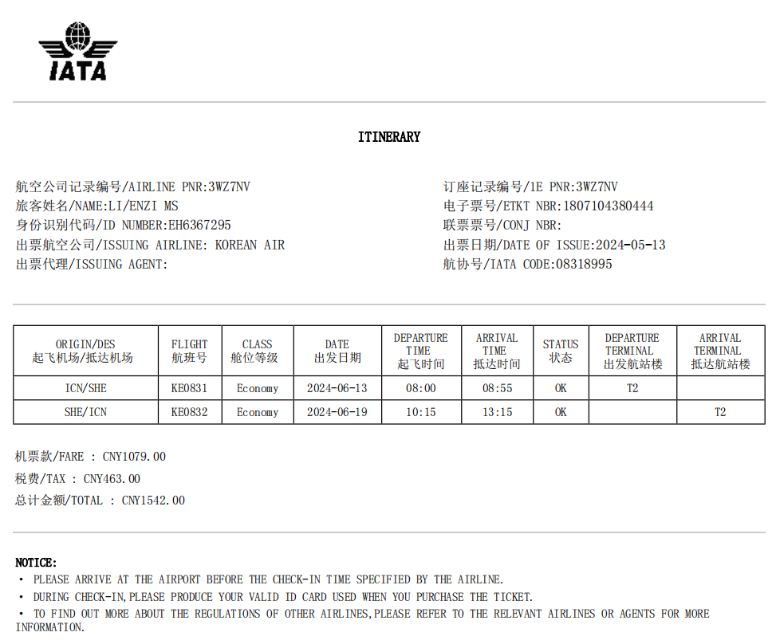
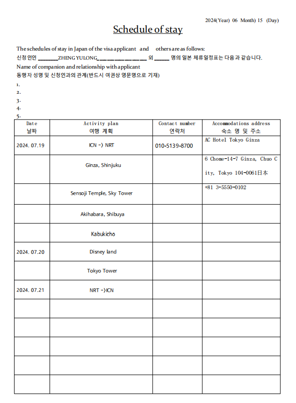
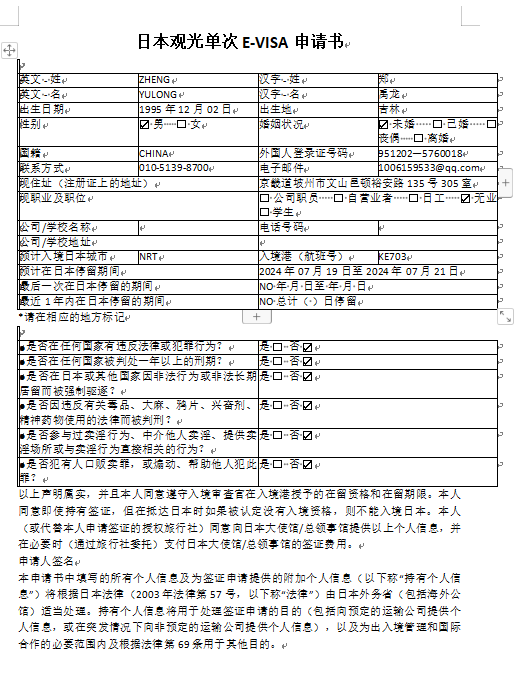

# 旅游行程生成工具

## 需求描述
### 主要需求
由用户输入客户信息（一个一个客户的输入），然后生成该客户的 来回机票、旅游行程安排、申请单 四个word文件。

> 客户信息 

1. 名称：郑禹龙 
2. 是否有犯罪记录：没有无犯罪记录
3. 是否已婚：未婚
4. 邮箱：1006159533@qq.com
5. 联系方式：010-5139-8700

### 机票
1. 机票模板如下

   
### 旅游行程
1. 旅游行程模板如下

### 申请单
1. 申请单模板如下

1. 姓
2. 名
3. 出生日期
4. 出生地
5. 国籍
6. 证件号码
7. 联系方式
8. 电子邮件
9. 性别
10. 现在居住地址
11. 当前职业（单选：公司职员|自营业者|日工|无业|学生）
12. 旅游时间区间（出发日期与返回日期）
